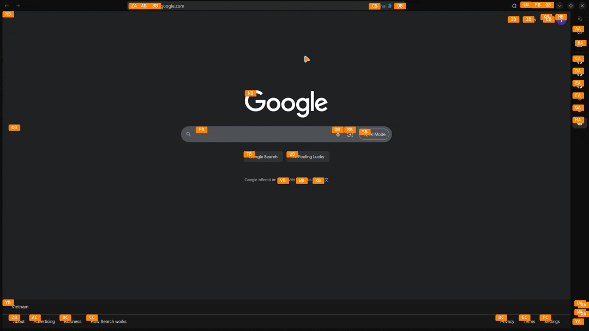

# warpd - Enhanced with Smart Hint

A modal keyboard-driven interface for mouse manipulation, now featuring intelligent UI element detection.

This fork extends the original [warpd](https://github.com/rvaiya/warpd) with **Smart Hint Mode** - an element-based detection system that automatically identifies interactive UI components for precise navigation.

## Features

### Core Modes
- **Hint Mode** (`Alt-Meta-x`) - Generate hints for visible elements
- **Grid Mode** (`Alt-Meta-g`) - Navigate using quadrant subdivision  
- **Normal Mode** (`Alt-Meta-c`) - Precise cursor movement with hjkl keys

### 🆕 Smart Hint Mode
*Inspired by [Vimium](https://github.com/philc/vimium)*

Automatically detects interactive UI elements (buttons, links, inputs) and generates hints for direct navigation.

<p align="center">

</p>

**Usage:**
1. Enter Normal Mode (`Alt-Meta-c`)
2. Press `f` to activate Smart Hint
3. Type the hint label to navigate to any interactive element
4. Press `Escape` to return to Normal Mode

**Detection Methods:**
- **Primary**: Platform-native accessibility APIs
  - Linux: AT-SPI (Assistive Technology Service Provider Interface)
  - macOS: Accessibility APIs  
  - Windows: UI Automation APIs
- **Fallback**: OpenCV-based visual detection for unsupported applications

*Note: Accessibility APIs provide the most accurate detection. OpenCV fallback uses computer vision to detect UI elements when native APIs are unavailable.*

## Quick Start

### Installation

**Automatic (Recommended):**
```bash
curl -fsSL https://raw.githubusercontent.com/atuan26/warpd/master/install.sh | sh
```

**Manual Build:**
```bash
git clone https://github.com/atuan26/warpd.git
cd warpd
# Install dependencies for your platform (see Dependencies section)
make && sudo make install
```

### Basic Usage

1. Run `warpd`
2. Use hotkeys to activate modes:
   - `Alt-Meta-x` - Hint mode
   - `Alt-Meta-g` - Grid mode  
   - `Alt-Meta-c` - Normal mode
3. From Normal mode, press `f` for Smart Hint
4. Click with `m` (left), `,` (middle), `.` (right)
5. Press `Escape` to exit

## Contributing

Contributions are welcome! Please feel free to:
- Report issues and bugs
- Submit feature requests  
- Create pull requests
- Improve documentation

## Limitations

- Smart Hint requires accessibility API support (may not work with all applications)
- OpenCV fallback provides broader compatibility but may be less precise
- Wayland support has limitations due to security model
- Some applications may need accessibility permissions enabled

## License

See [LICENSE](LICENSE) file for details.

---

*For detailed documentation, see the [man page](warpd.1.md).*